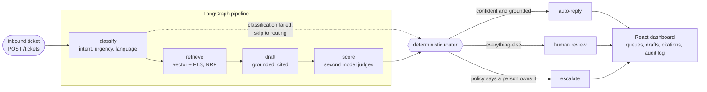
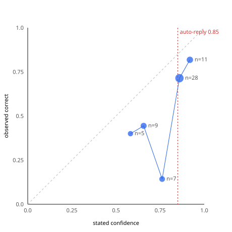

# Customer Support Triage Agent

[](https://github.com/prayagtushar/support-triage-agent/actions/workflows/ci.yml)
[](LICENSE)
[](api/pyproject.toml)
[](https://support-triage.prayagtushar.xyz)

**[Live review queue →](https://support-triage.prayagtushar.xyz)** No signup.

An LLM agent that triages inbound customer support tickets end to end. Each ticket is classified by intent and urgency, matched against similar resolved cases, answered with a grounded draft reply, scored by a second model, and then routed by deterministic code. Confident, well-grounded drafts go to an auto-reply queue. Everything else lands in a human review queue with the full context attached.

The tickets are a **consumer e-commerce mobile app's**: order tracking, refunds, double charges, account lockouts, app crashes and feature requests, in English and Hinglish. That domain is named because the eight intents only cohere under it — a pure retailer never gets a feature request, a pure SaaS product never ships a package — and because it was not chosen first. It was inherited from the corpus, which is a mistake worth reading about in the [eval card](docs/EVAL_CARD.md) before copying the taxonomy.

Ticket triage is one of the most widely deployed production uses of LLM agents, because the agent does not need to resolve every ticket. It needs to understand each ticket well enough to classify it, draft a response when the evidence supports one, and know when to hand off. This project treats that handoff as the feature: a deterministic routing policy, a human review queue, an audit trail, and an eval suite that measures whether the handoff decision is any good.


A real ticket from the review queue, and the handoff working exactly as designed. A customer lost the phone holding their 2FA codes. The drafter cited five cases and claimed the only route back in is identity verification by support. But every case it cited is about recovering a *PIN*, not a lost second factor, so the judge scored groundedness 1/5 and said why. Note what the composite breakdown exposes: the classifier's self-reported 0.95 contributes **more** (0.285) than the judge's actual assessment of the draft (0.233). That is the weighting problem `make ablate` measures, visible on a single ticket.


The review queue. Lanes are the left rail, because a lane is somewhere you work rather than a view you switch to. The notch on every confidence bar is the 0.90 auto-reply threshold, so each row shows not just a score but its distance from the decision that score drove. That distance is the only part of the number that changed the outcome.

### Try it

- **[Open the review queue →](https://support-triage.prayagtushar.xyz)** It opens on the least confident ticket in the lane, which is where the handoff is easiest to watch.
- **[Send it your own ticket →](https://support-triage.prayagtushar.xyz/submit)** No account, no key. It runs the real pipeline, so give it about 40 seconds — then approve, edit or reject the reply it drafted for you.
- **[Read the evals →](https://support-triage.prayagtushar.xyz/evals)**

Reading is open to everyone. Submitting a ticket or recording a review spends a pipeline run against three model providers, so those are capped.

## Architecture



Key design decisions:

- **The agent is a typed state machine, not a free-running loop.** Every node has a bounded job and its own failure handling. No node raises: failures become state, and the router turns them into a human_review route. A ticket that cannot be classified skips retrieval and drafting entirely, because spending drafter tokens on a ticket you could not classify is waste with extra risk.
- **Routing is deterministic code over model-produced scores.** The LLM proposes; a threshold policy disposes. Thresholds live in configuration, so a policy change is a config change. The router is pure and has 19 unit tests covering every early exit, both threshold boundaries, and P1 beating a perfect composite.
- **The judge runs on a different vendor from the drafter,** enforced at startup rather than by convention. `Settings` refuses to boot if they match. A model grading its own output exhibits self-preference bias, and the router consumes that score as truth.
- **The domain is configuration, not an assumption.** `DOMAIN` is given to the classifier and the drafter, and reported by `GET /policy`. It was previously a phrase inside one prompt and absent from the drafter entirely, which made the single most load-bearing assumption in the system invisible and unchangeable.
- **Retrieval reports the provenance of its evidence.** Two intents have no real cases behind them, so a draft can be machine text grounded in machine text. A result whose every case was generated is flagged `synthetic_only` and surfaced to the reviewer, rather than reading like any other citation. It does not change the route: that would move the policy these numbers were measured under.
- **Retrieval reports its own weakness.** The weak signal is raw cosine similarity, not the fused score: fusion is relative to whatever came back, so it stays high even when everything returned is irrelevant. Similarity is absolute and can say "nothing here is close."

## Stack

| Layer | Choice |
|---|---|
| Orchestration | LangGraph, Postgres checkpointer |
| API | FastAPI, Pydantic v2, psycopg3 |
| Storage and retrieval | PostgreSQL + pgvector, hybrid vector + full-text with reciprocal rank fusion |
| Models | Llama 3.3 70B (classify), Sarvam-105B (draft), Gemini 2.5 Flash Lite (judge), all behind one OpenAI-compatible client. Embeddings are `text-embedding-3-small` at 1536 dims via OpenRouter. The corpus was originally embedded with `gemini-embedding-001`, and moving between them means re-embedding every row, because vectors from different models are not comparable |
| Observability | Langfuse traces, structlog JSON logs |
| Evaluation | 60-ticket golden set, threshold sweep, reliability diagram, regression gate |
| Dashboard | Vite, React 19, TanStack Query, Tailwind v4, Geist Mono. Charts are hand-drawn SVG: two plots of a dozen points each, where a charting library would have outweighed the code it replaced |
| Packaging | uv, bun, Docker Compose |

## Dashboard

An operator console, not a report. The three lanes are the left rail and the queue is the
workspace; everything on screen is data the pipeline already recorded rather than anything
computed for display.

- **Queues.** One lane per route, each a URL of its own. Filter, and sort by age, urgency or
  confidence. Age is coloured against the response window for the ticket's priority, because
  in a queue age is a risk signal rather than a fact.
- **Review.** The draft, the judge's three sub-scores and reasoning, the retrieved cases with
  citation markers and similarity, the classifier's rationale, and the composite broken into
  its weighted parts. Below that, the pipeline as it actually ran: five nodes, real per-node
  latency drawn in proportion, and the model, provider and rupee cost of each. A ticket that
  failed classification shows retrieve, draft and score as *skipped*, because declining to
  spend drafter tokens on an unclassifiable ticket is a design decision worth seeing.
  Driveable from the keyboard — `a`, `e`, `r` to act, `j`/`k` through the lane, `?` for the
  list — and acting advances to the next ticket, because clearing a queue is the job.
- **Evals.** The measurement page, leading with the metric that misses its target rather than
  burying it. Threshold sweep and reliability diagram as plots, every proportion carrying its
  denominator and a Wilson interval, and a baseline table so the routing numbers can be read
  against the policies they have to beat.
- **Audit.** Every human decision in the order it happened, append-only, with the confidence
  the agent reported at that moment and the reason a draft was rejected.
- **Submit.** Send a ticket as a customer would and watch the stages land. Progress is read
  back from the LangGraph checkpointer, so the stages are the ones that actually completed
  rather than a timer pretending. No account and no key.
- **Run it.** What the thing would cost against your own ticket volume, where it sits in an
  existing support stack, and the live routing policy rendered as the config you would edit.

Three things the dashboard does deliberately:

**A rejected draft has to say why.** Rejecting asks for a reason from a fixed taxonomy —
hallucinated, wrong intent, wrong tone, missing info, not answerable — and an edit stores the
drafter's original next to what the human sent. The golden set is 60 tickets and every
headline metric is limited by that, so the review queue is the cheapest source of new labelled
examples this project has. A free-text box would have produced comments instead.

**It never hardcodes the policy.** Thresholds and composite weights come from `GET /policy`, so the notch on every meter and the arithmetic in every breakdown track the config actually in force. A dashboard that drew its threshold from a constant would start lying the first time the policy was retuned, which, given the ablation result below, is the next thing that should happen.

**It says when the system is serving but not working.** `GET /status` reports the empty-retrieval rate over recent runs, and a banner appears when retrieval has stopped producing evidence. That check exists because of a real outage: the embedding key ran out of credit, every retrieval returned nothing, every ticket was correctly routed to a human by hard rule, and no conventional signal moved. Nothing failed. The system just quietly stopped knowing anything.

## Evaluation

Measured on golden v0 (60 hand-written tickets, 27% non-English, 5 adversarial). Reports are in `api/evals/reports/`, and the tables below are generated from the same export the dashboard reads, so the two cannot drift.

<!-- metrics:start -->

Run `v2-threshold-090` on golden `v0`, 60 tickets, auto-reply threshold 0.9, measured 2026-08-01. Regenerate this block with `make readme-metrics`.

**Decisions the routing gets to make.** Small denominators, so intervals:

| Metric | Value | n | 95% CI |
|---|---|---|---|
| Auto-reply precision | **0.500** | 5/10 | 0.24–0.76 |
| Review recall | 0.821 | 23/28 | 0.64–0.92 |
| Routing accuracy | 0.417 | 60 | — |

**Classification, measured across every ticket.** Stable to three decimals:

| Metric | Value | n |
|---|---|---|
| Intent accuracy | **0.950** | 60 |
| Intent macro F1 | 0.953 | 60 |
| Intent, English | 0.977 | 44 |
| Intent, Hinglish | 0.867 | 15 |
| Urgency accuracy | 0.767 | 60 |
| Language accuracy | 1.000 | 60 |

**Cost and latency.** ₹0.050 a ticket · p50 21.8s · p95 48.1s · mean 24.2s. Triage is asynchronous, so p95 bounds how long a ticket waits before a human sees it in the queue, not how long a customer waits on a page.

**Against the policies it has to beat:**

| Policy | Auto-reply precision | Review recall | Answers sent |
|---|---|---|---|
| Every ticket to a human | never answers | 1.000 | 0 |
| Shipped composite at 0.9 | 0.500 | 0.821 | 10 |
| No judge, best threshold | 0.585 | 0.393 | 41 |
| Judge only, best threshold | 0.667 | 0.786 | 18 |

**Calibration.** Every bucket claims more than it delivered:

| Bucket | n | Stated | Observed | Gap |
|---|---|---|---|---|
| 0.5–0.6 | 5 | 0.580 | 0.400 | −0.180 |
| 0.6–0.7 | 6 | 0.637 | 0.500 | −0.137 |
| 0.7–0.8 | 13 | 0.757 | 0.385 | −0.373 |
| 0.8–0.9 | 25 | 0.856 | 0.360 | −0.496 |
| 0.9–1.0 | 11 | 0.916 | 0.545 | −0.370 |

**Per intent:**

| Intent | Precision | Recall | F1 | Support |
|---|---|---|---|---|
| billing | 1.000 | 0.875 | 0.933 | 8 |
| refund | 1.000 | 1.000 | 1.000 | 7 |
| account access | 0.900 | 1.000 | 0.947 | 9 |
| bug report | 0.800 | 1.000 | 0.889 | 8 |
| how to | 1.000 | 0.750 | 0.857 | 8 |
| shipping | 1.000 | 1.000 | 1.000 | 7 |
| feature request | 1.000 | 1.000 | 1.000 | 6 |
| other | 1.000 | 1.000 | 1.000 | 7 |

<!-- metrics:end -->



**Three things these tables are saying honestly, which matter more than the numbers themselves:**

**1. Auto-reply precision does not meet the bar this system was designed against.** The target was 0.95. Across the full threshold sweep the system reaches 0.727 at 0.85 and 0.778 at 0.90; at 0.95 it auto-replies to nothing. The threshold was raised from 0.85 to 0.90 to trade coverage for safety, and the bar was not lowered to make the number look met. On this corpus, auto-reply is not safe to enable at the intended standard, and the baseline table says so plainly: routing every ticket to a human is still the safer policy here.

**2. The intervals are wide because the metric is unstable at this sample size.** Two runs with identical configuration produced auto-reply precision of 0.778 and 0.500. At a 0.90 threshold only ~10 tickets are auto-replied, so one flip moves precision ten points, and the 95% interval on the headline number spans most of the range it could take. Intent accuracy, measured across all 60 tickets, was stable to three decimals across both runs. Growing the golden set is a precondition for the headline number to mean anything, not polish.

`make coverage` works out the size instead of guessing at a round one. The precision denominator is not how many tickets are labelled `auto_reply`. It is how many the system chooses to send, which at this threshold is 17% of the set. Resolving precision to ±0.05 therefore needs a denominator of 20, so **~120 tickets, not 100**. Note the direction of that interaction: raising the threshold for safety shrinks the denominator, so the headline metric gets noisier exactly as the policy gets more conservative.

The review queue is where those tickets come from cheapest. Rejecting a draft requires picking a reason from a fixed taxonomy — hallucinated, wrong intent, wrong tone, missing info, not answerable — so every review a human does adds a labelled example rather than a comment.

**3. The composite confidence is overconfident in every bucket.**

The weights (0.5 judge, 0.3 classifier, 0.2 retrieval) were a guess, and two of the three inputs are optimistic by construction. Fitting them against outcomes is the obvious next step.

The root cause under most of this is the corpus. Bitext's "resolutions" are largely templates, along the lines of *"please provide your account details and I'll look it up"*, so retrieval finds topically similar cases that contain no answer to ground on. 25 of 60 drafts declared themselves unable to answer while only 5 had weak retrieval, and the drafter was not wrong to.

Every failure above is written up per-component in [`docs/failure_analysis.md`](docs/failure_analysis.md): what happened, which part owns it, what I changed, and what I deliberately did not change. [`docs/EVAL_CARD.md`](docs/EVAL_CARD.md) states what the system is for, what it is not for, and where each of these numbers stops applying.

## What works well

Classification is strong: 0.950 intent accuracy, stable to three decimals across repeated runs, and language detection correct on all 60 tickets. That last figure needs one qualifier the table cannot carry. The set is 44 English and 15 Hinglish against a single Devanagari ticket, so "correct on Devanagari" rests on n=1 and should not be read as a claim about the script. `make coverage` reports that gap rather than leaving it to be discovered. One measured prompt change took intent accuracy from 0.867 to 0.967 on the classifier eval by fixing a single systematic error, where the model was treating "phrased as a question" as meaning `how_to`.

The judge earns its place. Three times during development the drafter invented something and the judge caught it precisely: an invented cancellation-link location, a claim to have checked a transaction the agent has no access to, and a refund timeline supported by nothing. Each time the composite fell and the router sent the ticket to a human instead of a customer.

`make ablate` puts a number on that. It re-routes the stored eval runs under reweighted composites offline, with no API keys and no cost, and refuses to report anything until it has replayed all 60 recorded routes from the stored signals. The stable finding across both runs is one I did not expect: **weighting the judge at 1.0 and dropping the other two inputs beats the shipped 0.5/0.3/0.2 composite** (0.800 vs 0.778, and 0.667 vs 0.632). The classifier and retrieval terms are diluting the judge rather than supplementing it, which makes the "the weights were a guess" caveat above concrete rather than modest. Whether the judge is strictly *necessary* is still unsettled at n=60, because that arm flips sign between runs.

## Data

3,400 resolved cases: 3,000 from the [Bitext customer support dataset](https://huggingface.co/datasets/bitext/Bitext-customer-support-llm-chatbot-training-dataset) mapped from 27 intents onto 8, plus 400 generated. Bitext contains no `bug_report` or `feature_request` cases at all, so those two intents are synthetic. 80 Hinglish cases are also generated, and are marked `source='synthetic'` in the schema. Rows containing Bitext's `{{Order Number}}`-style template placeholders were dropped rather than filled with invented values.

The Hinglish set has not yet been reviewed by a native speaker, so this README does not describe it as hand-verified.

The split is uneven in a way the per-intent table cannot show. Six intents carry 500 real Bitext cases each; `bug_report` and `feature_request` carry **none** and are made entirely of the 340 generated ones. Drafts for those two retrieve generated cases to answer generated tickets and are graded by a third model, so `feature_request` reporting a perfect 1.000 F1 on a support of 6 measures how alike two generation processes are, not competence. Treat both intents as untested.

## Data handling

Every ticket body is sent to three third-party model providers. For this project the corpus is public and synthetic, so nothing sensitive leaves the machine. A production deployment handling real tickets would need PII redaction before egress, or a self-hosted model for the classification step. Sarvam is India-based, which matters for data residency under Indian regulation. The other two are not.

## Getting started

```bash
git clone https://github.com/prayagtushar/support-triage-agent
cd support-triage-agent
cp api/.env.example api/.env   # three provider keys
make demo                      # database, corpus, embeddings, seeded queues
make run                       # http://localhost:5173
```

`make demo` builds the corpus once — about ₹3 in embeddings and a few minutes. After that
`make run` is the only command: it starts Postgres, applies any pending migrations, and runs
the API and the dashboard together. Ctrl-C stops both.

<details>
<summary>What <code>make demo</code> runs, if you would rather do it a step at a time</summary>

```bash
make up          # Postgres with pgvector
make migrate     # schema

cd api
uv run python scripts/load_corpus.py
uv run python scripts/gen_synthetic.py
uv run python scripts/gen_hinglish.py
uv run python scripts/embed_corpus.py

make seed-local  # run the golden set through the pipeline into the queues
```

</details>

`make seed-local` drives the graph directly rather than going through the API, because `POST /tickets` enforces a public-demo daily cap that a local database has no reason to be bound by. Sixty tickets costs about ₹3 and a few minutes.

Quality gates and evals:

```bash
make check       # ruff, mypy, the whole offline suite, under 5s
make eval        # full pipeline over the golden set, needs API keys
make calibrate   # reliability diagram
make ablate      # does the judge earn its weight? offline, free
make coverage    # where the golden set is too thin to support its claims
make degraded    # runs that finished but did not work
make ui-evals    # regenerate the dashboard's eval data from the latest report
make readme-metrics  # rewrite this README's metrics block from that same export
make gate        # fail if the latest run regressed against the baseline
```

`make help` lists every target with its one-line description; the two export targets exist
so the numbers in this README and the numbers on the evals page come from one file and
cannot disagree.

The default test suite is offline: anything needing a database, a network call, or an API key is behind the `integration` marker, so `make check` runs clean with nothing else started. CI runs exactly that, `make check` plus the dashboard's typecheck and build, on every push and pull request. The workflow is in [`.github/workflows/ci.yml`](.github/workflows/ci.yml). Full evals are a pre-merge make target rather than part of that suite, because they need provider keys and minutes of runtime.

## Deployment

The API runs on Cloud Run, the dashboard on Vercel, and Postgres on Supabase, all inside the free tiers.

**Reading is public.** The queues, each ticket's draft, the judge's reasoning and scores, the retrieved cases and the audit log are all browsable without an account, because that is the part worth looking at.

**Submitting is open.** No key and no per-visitor throttle: someone putting their own ticket through the pipeline is the point of a public demo, and gating that gates the only thing worth trying. The ceiling is the server-side cap of 50 tickets per rolling 24 hours, which is where it belongs — a key can leak, and a leaked key with no cap behind it is a bill.

**Reviewing is limited to the ticket you sent.** Approving and rejecting costs nothing, but it is append-only to the audit trail and it empties the review lane, so one visitor could leave the next with nothing to look at. The browser generates a random id, keeps it in `localStorage` and sends it as `X-Visitor`; a ticket is reviewable by whoever sent it. That is ownership, not identity, and no IP is stored. `X-Demo-Key` still overrides it for maintenance; there is no field for it in the dashboard, and the key is claimed once by visiting `/?key=<the-key>`, which stores it and strips the parameter back out of the URL.

The key is a speed bump, not authentication. The real ceiling is a server-side cap of 50 tickets per rolling 24 hours, which applies whether or not a key is configured: a cap that only bound authenticated callers would bound nothing, given the key is meant to be handed out.

Two deployment details are load-bearing rather than incidental:

- **`--no-cpu-throttling`.** `POST /tickets` returns 202 and runs the 39 to 48 second pipeline in a background task, after the response is sent. Cloud Run's default throttling would cut CPU at that exact moment and strand every ticket at status `received`. The failure is silent, with no error and just a queue that never moves, so `scripts/check_stuck.py` reports tickets that have sat in `received` too long.
- **`--max-instances 1`.** The provider rate limiters are per-process and set to free-tier ceilings. A second instance doubles the real request rate and earns 429s. This is a correctness constraint that happens to also be cheap.

Spend is capped rather than merely watched: a ₹150/month budget publishes to Pub/Sub, and a Cloud Function detaches the billing account if it is ever actually reached. The runbook, including the two IAM grants that make the kill switch work and how to recover from a trip, is in [`docs/DEPLOY.md`](docs/DEPLOY.md).

The deployed corpus was regenerated during deployment rather than copied, and generation is not deterministic. It holds 3,472 cases (3,000 Bitext, 399 synthetic, 73 Hinglish) against the 3,400 described above, with 7 Hinglish cases lost to provider timeouts. The eval numbers in this README were measured on the original corpus and have not been re-run against the deployed one.

## Repository layout

```
api/
  app/agent/       the LangGraph nodes, prompts and typed state
  app/retrieval/   hybrid search, RRF fusion
  app/routers/     FastAPI surface
  app/evals/       golden-set runner, metrics, scoring
  migrations/      plain SQL, applied in order
  scripts/         corpus build, evals, exports, operational checks
ui/
  src/routes/      queues, review, evals, audit, submit, run it
  src/components/  meters, badges, charts, the rail
  src/lib/         API client, policy, stats, formatting
infra/             Docker Compose, Cloud Run deploy script, billing kill switch
docs/              deployment runbook, failure analysis, eval card
```

## Documentation

- [`docs/EVAL_CARD.md`](docs/EVAL_CARD.md) — what the system is for, what it is not for, and
  where each number stops applying.
- [`docs/failure_analysis.md`](docs/failure_analysis.md) — every measured failure, per
  component: what happened, which part owns it, what changed, what deliberately did not.
- [`docs/DEPLOY.md`](docs/DEPLOY.md) — the runbook: access model, the two IAM grants behind
  the billing kill switch, and how to recover from a trip.

## Licence

MIT. See [LICENSE](LICENSE).
